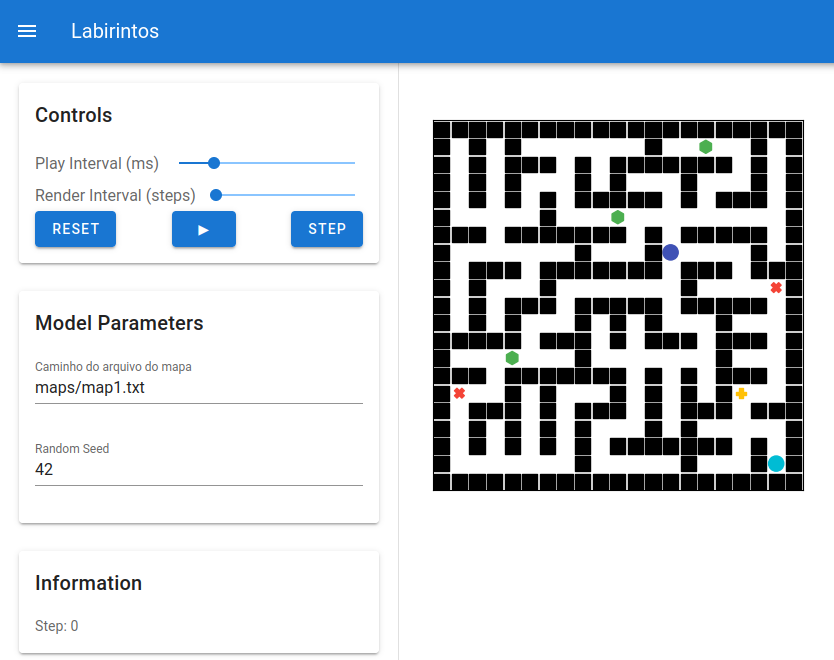
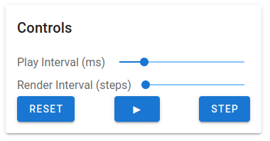
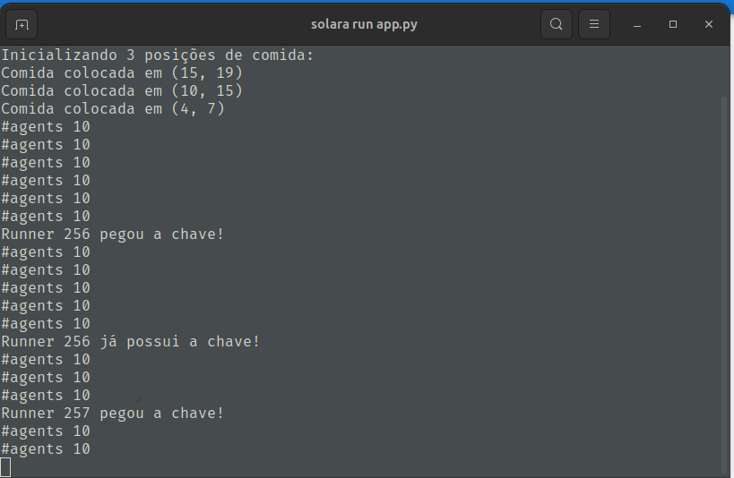

# Labirintos

**Disciplina**: FGA0210 - PARADIGMAS DE PROGRAMAÇÃO - T01 <br>
**Nro do Grupo**: 04<br>
**Paradigma**: SMA<br>

## Alunos

|Matrícula | Aluno |
| :--: | :--: |
| 20/2045624 | [Abdul hannan](https://github.com/hannanhunny01)	|
| 21/1029147 | [Arthur de Melo Viana](https://github.com/arthurmlv)	|
| 19/0026758 | [Deivid Carvalho](https://github.com/deivid-a1) |	
| 21/1062867 | [Felipe de Jesus Rodrigues](https://github.com/felipeJRdev) |
| 17/0108341 | [Levi de Oliveira Queiroz](https://github.com/LeviQ27) |	
| 17/0111059 | [Matheus Fonseca Sousa](https://github.com/gatotabaco) |	
| 19/0093331 | [Matheus Costa Gomes](https://github.com/mc-gomes) |	
| 21/1029559 | [Rafael Brito Bosi Rodrigues](https://github.com/StrangeUnit28) |	
| 16/0149410 | [Yudi Yamane de Azevedo](https://github.com/yudi-azvd)	| 

## Sobre 
Este projeto é uma simulação de um labirinto utilizando o [Mesa](https://mesa-readthedocs-io.translate.goog/stable/?_x_tr_sl=en&_x_tr_tl=pt&_x_tr_hl=pt&_x_tr_pto=tc) e a ferramenta [Solara](https://solara.dev/), que são, respectivamente, uma biblioteca para construção de modelos baseados em agentes e uma biblioteca para Python que facilita a criação de interfaces de usuário (UI) interativas e dinâmicas. O objetivo principal é criar um cenário dinâmico onde agentes (representados por corredores e inimigos) interagem e competem para alcançar a saída do labirinto, enquanto enfrentam obstáculos e buscam por chaves.

A simulação permite observar o comportamento de diferentes tipos de agentes, como Runners (corredores), Enemies (inimigos), e Key Agents (chaves), enquanto os dois primeiros se movem dentro de um labirinto gerado a partir de mapas definidos. Além disso, a interação entre os corredores é mediada por um sistema de feromônios que serve para guiá-los até a saída.

### Componentes Principais

Maze Model (Modelo do Labirinto): Controla o ambiente, onde os agentes são colocados. Inclui a estrutura do labirinto, com paredes, corredores, chaves e a saída.

- Agents (Agentes):
  - EnemyAgent: Inimigos que percorrem trajetos fixos no labirinto, indo e voltando.
  - RunnerAgent: Corredores que tentam alcançar a saída do labirinto. Eles podem coletar chaves e liberar feromônios para guiar outros corredores.
  - KeyAgent: Representa a chave que os corredores precisam para acessar a saída.
  - KeyCollectorAgent: Representa agentes que percorrem trajetos aleatórios em células vazias em busca da chave. Ao encontrá-la, a chave é reposicionada em um lugar aleatório do mapa.
  - ExitAgent: A saída do labirinto.
  - WallAgent: Representa as paredes que bloqueiam o caminho.

- Sistema de Feromônios: Corredores ao chegarem na saída em posse da chave liberam feromônios para ajudar outros agentes a encontrar o caminho mais rápido. Esses feromônios se dissipam com o tempo.

### Recursos Adicionais

Para explorar mais sobre as ferramentas e conceitos utilizados neste projeto:

- [Mesa - Documentação Oficial](https://mesa-readthedocs-io.translate.goog/stable/?_x_tr_sl=en&_x_tr_tl=pt&_x_tr_hl=pt&_x_tr_pto=tc): Uma excelente fonte para entender o uso de modelos baseados em agentes e como aplicá-los em simulações complexas.
- [Solara - Documentação Oficial](https://solara.dev/): A documentação oficial da biblioteca Solara, que facilita a criação de interfaces de usuário interativas em Python.
- [Introdução ao Paradigma de Agentes](https://www.devmedia.com.br/introducao-ao-paradigma-orientado-a-agentes/28791): Um artigo introdutório que explora o paradigma de agentes e suas aplicações em simulações e jogos.
- [Mesa Examples](https://mesa.readthedocs.io/stable/examples.html): Exemplos práticos de como usar a biblioteca Mesa para criar simulações e modelos baseados em agentes.

Esses recursos são ideais para aprender mais sobre a construção de simulações com agentes, como otimizar o comportamento dos agentes no labirinto e como criar interfaces dinâmicas e interativas com Solara. 
O repositório está aberto para sugestões e contribuições. Fique à vontade para melhorar o código, adicionar novos recursos ou simplesmente compartilhar suas ideias.

## Screenshots

O vídeo mostra o projeto do **Labirintos** em execução


## Instalação 
**Linguagens**: [Python3](https://docs.python.org/3/)<br>
**Tecnologias**: [Mesa](https://mesa-readthedocs-io.translate.goog/stable/getting_started.html?_x_tr_sl=en&_x_tr_tl=pt&_x_tr_hl=pt&_x_tr_pto=tc)<br>

### Pré-requisitos

Antes de começar a rodar o projeto, você precisará ter o [Python3](https://docs.python.org/3/) e o [pip](https://pip.pypa.io/en/stable/) instalados em seu sistema. Siga as instruções abaixo para garantir que todos os pré-requisitos estejam configurados corretamente:

1. Instalar o Python 3

**Para Windows:**

Baixe o Python 3 no [site oficial](https://www.python.org/downloads/).
Execute o instalador e, durante a instalação, marque a opção Add Python to PATH.

**Para macOS:**

O Python 3 geralmente já está pré-instalado. Caso não tenha, você pode instalar usando o Homebrew:

```bash
    brew install python
```

**Para Linux:**

Em distribuições baseadas no Debian (como Ubuntu), use o seguinte comando:

```bash
  sudo apt update
  sudo apt install python3
```

Em distribuições baseadas no Red Hat, use:

```bash
  sudo dnf install python3
```

2. Instalar o pip

O pip é o gerenciador de pacotes do Python. Em muitos sistemas, ele já vem instalado junto com o Python. Para verificar se o pip está instalado, execute:

```bash
  pip --version
```

Caso o pip não esteja instalado, execute o seguinte comando para instalar:

```bash
  python3 -m ensurepip --upgrade
```

3. Criando um Ambiente Virtual (opcional, mas recomendado)

É uma boa prática usar um ambiente virtual para evitar a instalação de dependências diretamente no sistema, o que pode causar conflitos entre projetos. O venv permite criar um ambiente isolado para o seu projeto.

Crie um ambiente virtual: Na pasta do projeto, execute o comando abaixo para criar um ambiente virtual. O nome do ambiente pode ser qualquer nome, como venv:

```bash
  python3 -m venv venv
```

Ative o ambiente virtual:

**Para Windows:**

```bash
  venv\Scripts\activate
```

**Para macOS/Linux:**

```bash
  source venv/bin/activate
```

Ao ativar o ambiente virtual, você verá o nome do ambiente aparecer no terminal, indicando que o ambiente virtual está ativo.

Quando terminar de trabalhar no projeto, você pode desativar o ambiente virtual com o comando:

```bash
  deactivate
```

4. Baixar as dependências do projeto

Uma vez que o Python, o pip e o ambiente virtual estejam configurados corretamente, você pode instalar as dependências necessárias para o projeto. Para isso, basta seguir os passos abaixo:

Clone o repositório ou baixe os arquivos do projeto.

Abra o terminal ou prompt de comando na pasta do projeto.

Execute o seguinte comando para instalar as dependências listadas no arquivo requirements.txt:

```bash
  pip install -r requirements.txt
```

Esse comando irá baixar e instalar todas as dependências do projeto, incluindo as bibliotecas Mesa, Solara e outras necessárias para a execução da simulação.

5. Executando o projeto

Após a instalação das dependências, você pode rodar o projeto com o seguinte comando:

```bash
  solara run app.py
```

6. Problemas comuns

- Problema: Dependência não encontrada
  - Verifique se você tem a versão correta do Python instalada.
  - Certifique-se de estar usando o pip correto (em alguns sistemas, pode ser necessário usar pip3 ao invés de pip).

- Problema: Erro de permissão ao instalar pacotes
  - Se você estiver tendo problemas de permissão, tente usar o sudo no Linux/macOS:

```bash
  sudo pip install -r requirements.txt
```

Sinta-se à vontade para contribuir com melhorias ou relatar problemas no repositório.

## Uso

Este projeto é uma simulação interativa de labirintos, onde agentes colaboram para alcançar a saída, enfrentando desafios e utilizando estratégias adaptativas. A simulação é implementada com as bibliotecas Mesa (para modelagem multiagentes) e Solara (para construção de interfaces gráficas dinâmicas). A seguir, explicamos como utilizar o projeto, desde sua configuração inicial até a interação com a interface gráfica.

### Como Rodar o Projeto

- **Instale as dependências necessárias**
  - Certifique-se de ter o Python instalado. Em seguida, inicie um ambiente virtual e depois execute o seguinte comando no terminal para instalar as bibliotecas utilizadas no projeto:
```bash
  source venv/bin/activate

  pip install -r requirements.txt
```

- **Inicie o projeto**
  - No diretório do projeto, execute o comando:

```bash
  solara run app.py
```

- **Acesse a interface gráfica**
  - Após iniciar o servidor, abra um navegador e acesse o endereço fornecido no terminal, geralmente:

```bash
  http://localhost:8765/
```

### Interagindo com a Simulação

Ao abrir a interface gráfica, você verá o layout do labirinto e os controles da simulação.

- **Tela Inicial**
  - O labirinto será gerado automaticamente com base nos mapas definidos no código.
  - Os agentes estarão posicionados em seus locais iniciais.

<center>

  
  Figura 1 - Tela inicial da aplicação 

</center>

- **Controles da Simulação**
  - Na interface, você encontrará os seguintes controles:
    - Play Interval (ms): Controla a velocidade da simulação em milissegundos.
    - Render Interval (steps): Define a frequência com que o labirinto é renderizado durante os passos da simulação.
    - Botões:
      - Play/Continue: Inicia ou retoma a simulação.
      - Step: Avança a simulação um passo de cada vez.
      - Reset: Reinicia a simulação e reposicionando os agentes.

<center>



Figura 2 - Controles do programa

</center>

- **Comportamento dos Agentes**

  - Durante a simulação, os agentes interagem no ambiente de forma dinâmica:

    - RunnerAgent (Corredor): Tenta alcançar a saída, coletando chaves e deixando feromônios para ajudar outros corredores.
    - EnemyAgent (Inimigo): Segue trajetos fixos no labirinto, criando obstáculos para os corredores.
    - KeyAgent (Chave): Fica localizada em pontos estratégicos do mapa. Deve ser coletada pelos corredores para liberar a saída.
    - KeyCollectorAgent: Percorre células vazias para reposicionar a chave após ela ser coletada.
    - WallAgent (Parede): Bloqueia o caminho dos agentes, definindo os corredores do labirinto.

- **Processo de Simulação**

  - Início: Após clicar em "Play", os agentes começarão a se mover pelo labirinto, seguindo suas respectivas regras.
  - Coleta de Chave: Quando um coletor encontra a chave, ela é reposicionada aleatoriamente no mapa, mantendo o desafio dinâmico.
  - Feromônios:  Os corredores que alcançam a saída em posse da chave liberam feromônios, ajudando os demais a encontrar o caminho ideal, mas apenas os corredores que já possuem a chave iram ser afetados pelo feromônio. Esses feromônios diminuem ao longo do tempo, simulando dissipação natural.
  - Finalização: A simulação pode ser reiniciada ou pausada a qualquer momento, permitindo que o usuário experimente diferentes configurações e observe o comportamento dos agentes.
  - Acompanhamento: Durante toda a simulação, no terminal estarão sendo printadas informações detalhadas sobre o que esta acontecendo no labirinto



Figura 3 - Informações no terminal

## Vídeo

O vídeo de apresentação do projeto esta disponível no seguinte [link](https://www.youtube.com/watch?v=YcGyWoq1I4w) ou no próprio projeto [aqui](./imagens/Gravação%20de%20SMA-20250127_182341-Gravação%20de%20Reunião.mp4)

## Participações

|       Nome do Membro        | Contribuição                                                                 | Significância da Contribuição para o Projeto | Comprobatórios |
| :-------------------------: | ---------------------------------------------------------------------------- | :----------------------------------------------------------------------------: | :-------------------------------------: |
| [Abdul hannan](https://github.com/hannanhunny01)	| - Fiz sistema de busca de comida no labirinto<br>- Adicionado método de busca de comida em todo o grid<br>- Otimizado algoritmo de pathfinding para encontrar comida<br>- implementacao do sistema de priorização de busca por comida quando saúde está baixa<br>- Corrigido bug na detecção de comida no parse_map | Boa | [link para commits](https://github.com/UnBParadigmas2024-2/2024.2_G4_SMA_Labirintos/commits/main/?author=hannanhunny01) |
| [Arthur de Melo Viana](https://github.com/arthurmlv)	| Adição do agente de coleta de chave. | Regular | [98de276d4796c414c356728b766162a938ca794d](https://github.com/UnBParadigmas2024-2/2024.2_G4_SMA_Labirintos/commit/98de276d4796c414c356728b766162a938ca794d) |
| [Deivid Carvalho](https://github.com/deivid-a1) | Adicionou a feature da chave | regular | [commit](https://github.com/UnBParadigmas2024-2/2024.2_G4_SMA_Labirintos/commit/f254058ccf2eb2f29c6671b9a9331bfe6b12fabd) |	
| [Felipe de Jesus Rodrigues](https://github.com/felipeJRdev) | Desenvolvimento da funcionalidade inicial para liberação de feromônios. Agentes runners que alcançam a saída do labirinto começam a liberar "feromônios" que atraem outros agentes dentro do alcance, direcionando-os para a saída. A implementação, posteriormente, foi ajustada para alinhar com as demais funcionalidades desenvolvidas pelo grupo. | Boa | [commits](https://github.com/UnBParadigmas2024-2/2024.2_G4_SMA_Labirintos/commit/14b087245866ae33a3541a53a54e682d3ace10e2) |
| [Levi de Oliveira Queiroz](https://github.com/LeviQ27) | Melhorou a movimentação dos enemies | Regular | [commits](https://github.com/UnBParadigmas2024-2/2024.2_G4_SMA_Labirintos/commits?author=LeviQ27) |	
| [Matheus Fonseca Sousa](https://github.com/gatotabaco) |  |  |  |	
| [Matheus Costa Gomes](https://github.com/mc-gomes) | Adicionou condição de parada, caso alguns runners fiquem sem vida | Regular | [commit](https://github.com/UnBParadigmas2024-2/2024.2_G4_SMA_Labirintos/commit/fe52af685a51768e1ff8f79549e9de29c81f25fd) |	
| [Rafael Brito Bosi Rodrigues](https://github.com/StrangeUnit28) | Ajuste na feature da chave, ajuste para que o feromônio só afetasse runners que possuissem a chave, ajuste para que apenas runners que achessem a saída e possuissem a chave soltassem feromônio, adição de novos mapas, tentativa de implementação de níveis, documentação do projeto e ajuste no visual do labirinto| Boa | [commits](https://github.com/UnBParadigmas2024-2/2024.2_G4_SMA_Labirintos/commits?author=StrangeUnit28) |	
| [Yudi Yamane de Azevedo](https://github.com/yudi-azvd)	| Setup do projeto, Parser de mapas (arquivos txt), comportamento do agente inimigo, agente corredor toma dano quando na mesma casa que um inimigo  | Boa  | [commits](https://github.com/UnBParadigmas2024-2/2024.2_G4_SMA_Labirintos/commits/main/?author=yudi-azvd)  | 


Nesse tópicos estão disponibilizadas algumas percepções dos membros do grupo

### Lições Aprendidas e Percepções

- O paradigma SMA foi um pouco mais desafiador, mas a dinâmica de múltiplos agentes trabalhando em conjunto trouxe um aspecto mais orgânico ao projeto. Apesar de ser mais complicado no começo, ele nos proporcionou uma ótima oportunidade para entender como agentes podem interagir e colaborar.

- Trabalhar com agentes em vez de uma abordagem centralizada fez com que o desenvolvimento se tornasse mais modular e flexível, mas também nos exigiu lidar com interações complexas entre os elementos do jogo.

- Acredito que conseguimos trazer uma boa adaptação do modelo SMA para o contexto de labirintos, mas precisamos evoluir mais na parte da movimentação e na introdução de novos tipos de comportamento para os agentes.

- Dificuldade de balanceamento das características dos agentes. Por exemplo, o coletor poderia ser autônomo e soltar a chave somente ao chegar num lugar distante da saída, mas ele resolve somente jogar para um lugar aleatório ou quando quisesse. Contudo, dificultaria demais para os runners. O mesmo vale para os inimigos.

### Contribuições

O projeto foi desenvolvido com a colaboração ativa de alguns dos membros da equipe. Durante o desenvolvimento, fomos capazes de integrar a estrutura básica de um sistema multiagentes (SMA), utilizando o Solara para interface de usuário e o Mesa para gerar a simulaçaõ da resolução do labirinto pelos agentes denominados 'runners'. O uso de feromônios para atrair os agentes até pontos específicos do labirinto foi um dos principais diferenciais, trazendo maior dinâmica ao jogo. Também foi implementada uma lógica de detecção de eventos, como a coleta da chave pelos 'runners'.

### Fragilidades

- O nível de complexidade do projeto poderia ser maior, já que o comportamento dos agentes ainda está muito restrito e os eventos não são suficientemente dinâmicos.
- O modelo de agentes autônomos é interessante, mas ainda carece de comportamentos mais elaborados. A movimentação dos 'enemies' é fixada, o que não permite que eles respondam de forma mais dinâmica ao ambiente ou ao comportamento dos 'runners'.
- A interação entre os agentes e a página web criada com o Solara ainda não é totalmente robusta. Existem limitações na forma como o Solara gerencia a atualização e configuração das propriedades da simulação.
- O projeto ainda não apresenta uma complexidade avançada em termos de decisões autônomas dos agentes. A ausência de uma interações mais detalhadas entre os agentes limita o grau de sofisticação do sistema.

### Trabalhos Futuros

- **Melhorar a Movimentação dos Agentes:** Atualmente, a movimentação dos 'runners' e dos 'enemies' é bastante simplificada. Um dos próximos passos é aprimorar esses movimentos, tornando-os mais objetivos e com a possibilidade de interagir de forma mais dinâmica com o ambiente e outros agentes.
- **Adicionar Maior Interatividade na Página Web:** O Solara proporciona uma interface interessante, mas seria interessante implementar funcionalidades que permitam ao usuário alterar mais parâmetros diretamente pela interface, como por exemplo, ajustar as configurações do labirinto ou dos agentes (comportamento, entre outros).
- **Movimentação dos 'Enemies':** A movimentação dos inimigos precisa ser ajustada para não ser fixa. Uma solução possível seria incorporar uma lógica de movimentação baseada em percepções do ambiente e feromônios deixados pelos 'runners'.
- **Introduzir Feromônios ao Encontrar a Chave:** Uma das melhorias seria permitir que os agentes deixem feromônios ao encontrar a chave, assim como já fazem ao achar a saída em posse da chave. Isso geraria uma dinâmica mais interessante e complexa para o comportamento dos 'runners' e 'enemies'.
- **Aprimorar Configurações do Labirinto:** Alterar o labirinto ou os parâmetros de agentes através da interface web criaria uma experiência mais interativa e flexível. Isso permitiria testar diferentes estratégias de jogo, além de tornar o projeto mais aberto a modificações e ajustes.
- **Adicionar Novos Tipos de Agentes:** Expandir o projeto para incluir diferentes tipos de agentes com comportamentos variados poderia aumentar a complexidade e tornar o sistema mais interessante. Diferentes tipos de 'runners', inimigos e até aliados poderiam ser implementados.
- **Adicionar "comida":** Seria interessante adicionar "comida" pelo labirinto para que os 'runners' pudessem recuperar parte da vida, caso tivessem perdido ao entrar em contato com os enemies


## Fontes

- [Mesa - Documentação Oficial](https://mesa-readthedocs-io.translate.goog/stable/?_x_tr_sl=en&_x_tr_tl=pt&_x_tr_hl=pt&_x_tr_pto=tc). Acesso em 24 de janeiro de 2025.
- [Exemplo Mesa Predação Lobo-Ovelha](https://mesa.readthedocs.io/stable/examples/advanced/wolf_sheep.html). Acesso em 15 de janeiro de 2025.
- [Solara - Documentação Oficial](https://solara.dev/). Acesso em 26 de janeiro de 2025.
- [Introdução ao Paradigma de Agentes](https://www.devmedia.com.br/introducao-ao-paradigma-orientado-a-agentes/28791). Acesso em 25 de janeiro de 2025.
- [Mesa Examples](https://mesa.readthedocs.io/latest/examples.html). Acesso em 25 de janeiro de 2025.
- ["Multiagent Systems: A Modern Approach to Distributed Artificial Intelligence" de Gerhard Weiss"](https://www.researchgate.net/publication/277217082_Weiss_Gerhard_Multiagent_Systems_a_Modern_Approach_to_Distributed_Artificial_Intelligence). Acesso em 26 de janeiro de 2025.
- ["The Nature of Code" de Daniel Shiffman"](https://natureofcode.com/). Acesso em 23 de janeiro de 2025.
- [Python3 Documentation](https://docs.python.org/3/). Acesso em 25 de janeiro de 2025.
- [pip Documentation](https://pip.pypa.io/en/stable/). Acesso em 25 de janeiro de 2025.
- [venv Documentation](https://docs.python.org/3/library/venv.html). Acesso em 25 de janeiro de 2025.
